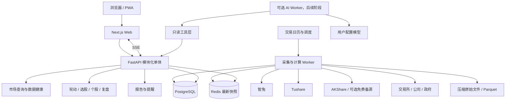
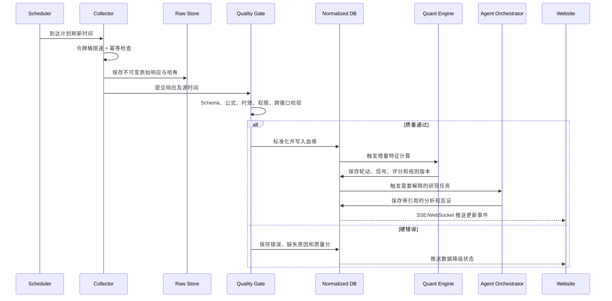
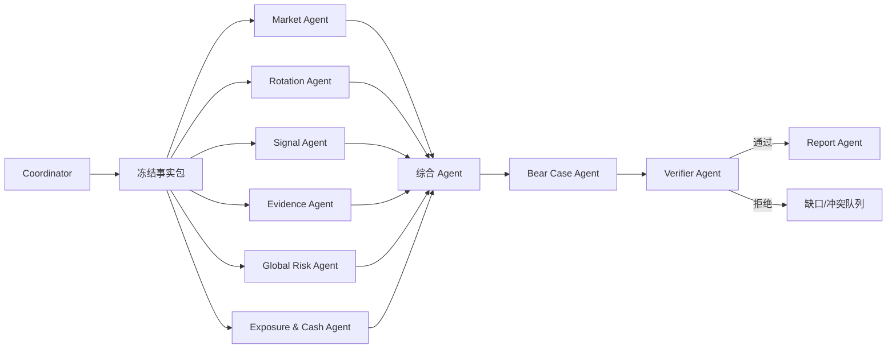
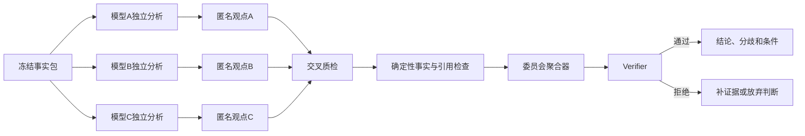

# 智兔量化分析网站架构与实现方案

> 版本：v1.9
> 日期：2026-07-15
> 定位：以智兔数服为主要 A 股结构化数据源，以确定性量化规则为基础，以 AI Agent 做证据检索、解释、反证和报告生成的短线研究平台。
> 默认范围：沪深主板，排除科创板、创业板、北交所、ST、`*ST` 及其他风险警示证券。
> 重要边界：系统输出研究优先级、条件式候选和模型组合区间，不承诺收益，不把评分解释成上涨概率。

---

## 1. 建设目标

网站不是简单地把股票 API 展示成行情页面，而是形成一条可追溯的研究流水线：

```text
真实数据采集
→ 原始数据留存
→ 数据质量校验
→ 标准化与特征计算
→ 已通过历史回放和影子运行的规则集
→ 大盘/情绪/轮动判断
→ 短线信号筛选
→ 公告与基本面证据验证
→ AI 多视角分析与反证
→ 条件式候选和风险计划
→ HTML 报告、提醒与复盘
→ 样本外评估和规则迭代
```

核心目标：

1. **数据尽可能新**：按供应商实际更新频率集中拉取，并向所有页面和用户复用同一份最新快照。
2. **数据绝对可追溯**：所有数值保留来源、接口、源时间、抓取时间、响应哈希和质量标记。
3. **量化与 AI 分工明确**：数值、筛选、评分、轮动和回测由确定性程序完成；AI 负责阅读、归因、反证、场景分析和报告表达。
4. **不制造假精确**：没有经过样本外验证时，只输出“研究优先级”，不输出伪造的“涨停概率 80%”。
5. **可持续复盘**：每次分析固定预测截点和规则版本，T+1/T+5 后自动核验，不能事后改写原判断。
6. **个人可用、未来可扩展**：第一阶段按个人研究平台设计，但数据、任务和权限模型保留升级为多用户产品的能力。

生产规则必须先完成最小历史回放和影子运行，才能进入正式扫描器。回测不是第三阶段才补做的展示功能，而是第一版正式候选的发布前置条件。

### 1.1 新增需求的正式产品表达

1. **散户情绪与筹码结构分析**
   建立可量化的散户情绪指标，综合上涨/下跌家数、涨跌停、炸板、成交拥挤、追涨强度、小单行为代理、搜索与讨论热度等信号，识别恐慌、观望、修复、亢奋和退潮阶段。同时结合筹码峰、换手、量价、成本带、套牢盘与获利盘变化，识别“低位筹码集中”“高位筹码松动”“放量换手承接”等结构。系统只能表述为**资金行为代理和筹码结构推断**，不能把“主力吃筹码”当作已知事实。

2. **2000 年至今的 A 股历史事件与牛熊周期知识库**
   这是长期研究资产，不进入首版交付范围。先建立数据模型和少量代表性事件样本，待短线数据、回测与复盘闭环稳定后，再逐年补齐可以按年、月、周、日下钻的时间线。每个事件同时展示发生时间、信息公开时间、官方来源、当时市场环境、影响指数与行业、价格反应、影响路径、持续时间、反证和事后复盘；牛熊周期不得只凭事后高低点武断定义。

3. **实时大盘指数中心**
   首页持续更新上证指数、深证成指、沪深 300、上证 50、中证 500、中证 1000等核心指数，同时显示涨跌幅、成交额、量比、分时走势、市场宽度、风格差异、源时间和数据延迟。后端集中采集，前端通过 SSE/WebSocket 接收更新；行情过期时必须明确降级，不能把缓存值冒充实时值。

### 1.2 暂不建设的能力

- 不直接连接券商自动下单；
- 不代替用户完成个性化适当性判断；
- 不把五档行情称为完整交易所 Level-2；
- 不在没有授权的情况下重新分发付费原始行情；
- 不用大模型直接计算技术指标、收益率或回测结果；
- 不用模拟、演示、占位或模型编造数据生成正式分析。
- 没有账户级数据时不宣称掌握散户真实持仓、成本和情绪；
- 没有合法L2逐笔委托时不识别真实主力身份、撤单意图或完整订单队列；
- 没有相应数据源时不建设期权隐含波动率、实时社交舆情或盘口订单流功能；
- 没有样本外校准前不输出精确上涨、涨停或连板概率。

---

## 2. 总体架构



图中的市场查询、研究、报告、Provider、质量、规则和提醒均为**代码内逻辑模块**，不是首版需要独立部署的微服务。个人版只运行三个主要进程：`web/api`、`worker/scheduler` 和数据库；AI Worker 在后续阶段按需启用。只有出现独立扩容、故障隔离或多用户并发需求时才拆服务。

### 2.1 架构原则

- **中心化采集，客户端扇出**：浏览器永远不直接请求智兔。后台每分钟抓一次，Redis 缓存后推送给所有页面，用户数量不会线性放大上游请求量。
- **原始层不可变，衍生层可重建**：原始响应压缩保存并记录哈希；标准化表、特征和评分可以按规则版本重新计算。全市场分钟原始数据长期归档为 Parquet，不默认逐股逐分钟全部写入 PostgreSQL。
- **事件驱动而不是页面驱动**：行情更新触发质量校验和增量计算，而不是用户刷新页面才临时分析。
- **批处理与实时链分开**：财务、公告、历史回补走低频批处理；行情、指数、涨跌停和提醒走盘中链路。
- **AI 在数据之后运行**：未通过真实性、质量和证据闸门的数据不得进入 Agent 正式分析。
- **每个结论可复现**：保存输入快照 ID、规则版本、Prompt 版本、模型版本、引用和输出哈希。

---

## 3. 数据源设计

### 3.1 智兔数据职责

| 数据域 | 主要用途 | 推荐刷新策略 | 备注 |
|---|---|---|---|
| 全市场实时快照 | 大盘宽度、全市场预筛、板块聚合 | 交易时段每分钟一次 | 按当前 Skill 记录，接口本身约一分钟更新且全市场接口有每分钟一次限制；上线前需再次核对套餐合同 |
| 最多 20 股实时行情 | 自选股、候选池、重点跟踪 | 每分钟，按 20 只分批 | 只在全市场快照不含所需字段时补充 |
| 单股实时/分时 | 个股详情与盘中确认 | 按活跃页面或告警条件调度 | 避免所有股票逐只轮询 |
| 指数实时 | 大盘、风格和基准 | 每分钟 | 保存交易时段和源时间 |
| 涨停/跌停/炸板池 | 情绪、连板、封板和炸板结构 | 约 10 分钟或文档允许频率 | 页面必须显示独立时间戳，不能伪装成分钟级 |
| 日线/分钟线 | 技术特征、同时间比较、复盘 | 盘中增量、盘后校准 | 明确复权方式；实时价不复权，趋势一般前复权 |
| 股票列表/ST 列表 | 可交易范围硬过滤 | 每交易日盘前和盘后 | 保存历史版本，防止回测幸存者偏差 |
| 财务报表/指标 | 基本面和业绩弹性 | 披露日增量刷新 + 每日补漏 | 保存报告期、首次披露和修订时间 |
| 股东/股本/分红 | 供给、股本变化和公司行为 | 日频或披露后刷新 | 不能单独推断资金意图 |
| 五档行情 | 盘中深度辅助 | 只跟踪重点候选 | 不等同完整 L2，不做完整订单流声明 |

筹码峰若智兔不直接提供，应由历史成交数据按明确算法计算，并保存算法版本、复权口径、时间窗口和价格分箱。缺少逐笔委托时，只能形成近似成本分布，不能宣称还原真实持仓账户结构。

### 3.2 免费官方资讯来源

优先建立官方来源采集器，而不是先购买聚合新闻：

- 巨潮资讯、上交所、深交所公告；
- 国务院、人民银行、证监会、发改委、工信部、商务部、海关总署；
- 公司官网新闻、投资者关系、互动问答和调研记录；
- 美国 Federal Reserve、US Treasury、White House、USTR、BIS、OFAC；
- 日本央行、财务省、METI、JPX；
- 韩国央行、企划财政部、MOTIE、KRX；
- 客户、供应商、政府采购和行业协会的官方材料。

媒体只用于发现线索。影响评分的订单、产能、政策、制裁、关税和公司事实必须回到原文。

### 3.3 互补数据适配器

设计统一 `MarketDataProvider`、`FundamentalProvider`、`NewsProvider` 和 `GlobalProvider` 接口，避免业务代码绑定单一供应商。

建议的互补方向：

- **Tushare 官方接口**：使用官方 SDK/API 和独立 Token，补充交易日历、历史行情、财务、复权因子、指数成分、行业分类、国际指数和部分特色数据；
- **Tushare 中转服务**：作为可选兼容适配器，仅在服务商具有合法数据授权、接口协议明确且用户主动配置时启用；中转数据不得被当作独立数据源参与“双源一致”证明；
- **AKShare**：作为免费、可插拔的发现、回补和交叉检查来源，记录 AKShare 版本、目标站点、采集时间和原始字段；不把依赖网页结构的接口当作生产实时主源；
- **Baostock**：作为免费的 A 股历史日线、基础资料和回补备源；不承担盘中实时、涨跌停池或高频任务，字段覆盖不足时明确返回 `not_supported`；
- **YFinance**：只用于海外指数、ETF、汇率、商品和个股日线/基础快照的风险参照；按“尽力而为、可能延迟”处理，不把它标注为交易所级实时行情，也不用于证明 A 股主力、板块宽度或涨跌停结构；
- **官方交易所/公司披露**：裁决财务和公司事实；
- **海外市场数据供应商**：美股、日本、韩国、港股、利率、汇率和商品；
- **自建 SearXNG**：作为免费的新闻线索发现层，搜索结果必须回到政府、交易所、公司等原文；不默认自动选择公共实例，避免隐私、限流和可用性不可控；
- **本地 Ollama**：作为无 API 调用费的可选模型适配器，用于摘要、分类和草稿；仍需通过模型能力探测、固定评测和事实校验，不能因“本地运行”降低正式分析门槛；
- **未来 L2 供应商**：只通过独立适配器接入，权限、存储、展示和再分发单独控制。
- **历史政策与事件来源**：国务院政策文件库、证监会、人民银行、财政部、国家统计局、交易所、中央政府网站及相应海外官方机构；市场数据与事件文本分开存储并建立引用关系。

禁止为了“接口有数据”而重复购买同源聚合数据。关键是独立性、时间戳和可追溯性。

### 3.4 多数据源优先级

默认优先级按数据域单独配置，不能使用一个全局顺序覆盖所有数据：

| 数据域 | 主数据源 | 第一备选 | 第二备选 | 裁决来源 |
|---|---|---|---|---|
| A 股盘中实时行情 | 智兔 | Tushare 官方实时接口（有权限时） | 合法中转/AKShare 临时降级 | 交易所口径与收盘校准数据 |
| 指数实时行情 | 智兔指数 | Tushare 官方 | AKShare | 指数公司/交易所 |
| 历史日线与复权因子 | Tushare 官方或智兔 | 智兔或Tushare官方 | AKShare/Baostock | 交易所公司行为与官方数据 |
| 财务报表和主营构成 | 官方公告/Tushare 官方 | 智兔 | AKShare | 交易所公告、巨潮资讯和公司原文 |
| 涨跌停、板块和特色榜单 | 智兔 | Tushare 官方特色接口 | AKShare | 原始行情重算结果 |
| 政策、公告和事件 | 政府/交易所/公司官网 | 合法聚合源 | AKShare 线索 | 官方原文 |
| 海外风险因子 | 对应交易所/央行等官方源 | 用户配置的合法行情源 | YFinance | 对应官方收盘数据 |

切换原则：

- 只有字段语义、复权口径、单位和时间粒度等价时才允许自动切换；
- 同一次正式分析固定 `provider_plan`，运行中不得悄悄从一个来源切换到另一个来源；
- 主源失败时先使用带时间戳的最近缓存并标记过期，再按规则切换备源；
- 备源恢复的数据需要通过 Schema、时间、价格、成交量、复权和证券状态检查；
- Tushare 官方与其兼容中转若来自同一底层数据，不能算作两个独立来源；
- AKShare 抓取失败、目标网站改版或字段变化时应熔断，不允许用空值或零填充正式分析。

### 3.5 统一 Provider 契约

每个适配器必须实现统一能力声明和标准结果：

```text
ProviderCapabilities
- provider_id / provider_type / adapter_version
- supported_domains / supported_frequencies
- realtime_level / history_start / max_batch_size
- quota_per_minute / quota_per_day
- license_scope / redistribution_allowed

NormalizedResult
- canonical_symbol / market / frequency
- source_time / fetched_at / available_at
- provider / endpoint / request_id
- adjustment / currency / unit / timezone
- payload_hash / quality_flags / raw_object_key
```

凭据分别使用 `ZHITU_TOKEN`、`TUSHARE_TOKEN`、中转服务密钥等环境变量或密钥管理服务配置。Token 不得进入浏览器、日志、HTML 报告、Agent Prompt或Git仓库。

### 3.6 多源交叉校验与冲突裁决

- 价格偏差、成交量偏差、交易状态、复权因子和证券名称分别设置容忍阈值；
- 不同来源的单位必须先标准化，不能直接比较“手”和“股”；
- 实时数据以 `source_time` 对齐，禁止拿不同分钟快照判断冲突；
- 收盘后使用官方/稳定历史源校准盘中快照，但不得覆盖原始记录；
- 出现冲突时保存所有来源值和裁决理由，降低质量分并阻止高风险正式结论；
- 前端显示当前主源、备用源、最后切换时间和数据质量，不只显示一个模糊的“实时”。

### 3.7 接口能力注册与功能开关

网站不能假设Token拥有文档中的全部权限。建立 `FeatureDependencyRegistry`，把每项功能绑定到真实接口：

```text
功能
→ 必需数据域
→ 主接口与备选接口
→ 权限和积分要求
→ 更新频率与历史起点
→ 字段Schema
→ 最近一次能力测试
→ enabled / degraded / disabled
```

管理员保存智兔、Tushare或其他凭据后，系统只执行低成本能力检查，不批量下载全量数据。检查结果区分：

- `available`：接口可调用且Schema符合预期；
- `permission_denied`：Token无权限，相关功能关闭；
- `quota_limited`：可用但额度不足，改为低频或手动；
- `empty_but_valid`：请求合法但当前没有数据；
- `schema_changed`：字段变化，停止进入正式分析；
- `stale`：接口成功但数据超过时效；
- `unknown`：尚未验证，不允许正式使用。

任何功能在必需接口不可用时必须隐藏、降级或明确显示缺失，不能用模拟数据填充。

### 3.8 重点接口到功能的映射

| 功能域 | 可用接口/来源 | 可实现功能 | 时间属性 |
|---|---|---|---|
| 市场实时 | 智兔全市场实时、指数实时、多股实时 | 宽度、结构牛熊、实时指数、候选扫描 | 盘中分钟级，按套餐权限 |
| 涨停生态 | 智兔涨停/跌停/炸板池、历史涨跌停价 | 首板、连板、炸板、封板质量和后续统计 | 股池约10分钟；历史池起点按接口实际值 |
| 资金结构 | 智兔资金流向、五档、当日逐笔 | 大中小单代理、承接与拥挤复盘 | 五档实时；资金流和逐笔以接口标注的盘后更新时间为准 |
| 公司与治理 | 智兔公司简介、经营范围、历届高管/董事 | 业务映射、管理层变化事件 | 日频 |
| 股本供给 | 智兔增发、解禁、分红；Tushare减持、回购、质押 | 供给压力和公司行为日历 | 日频/公告驱动 |
| 股东结构 | 智兔十大股东、流通股东、股东趋势、基金持股 | 集中度、户数变化、机构持仓变化 | 报告期/不定期，禁止当作实时资金 |
| 财务质量 | 智兔财务指标、利润、现金流、三大报表；Tushare财务和主营构成 | 业绩弹性、现金含量、应收/存货风险 | 披露后更新 |
| 交易行为 | Tushare龙虎榜、大宗交易、两融、沪深股通、异常波动 | 席位、杠杆、机构和异常交易复盘 | 多为盘后或T+1 |
| 竞价与热度 | Tushare集合竞价、热榜、涨停专题 | 竞价强度、关注度与价格背离 | 依接口权限，第三方特色数据需标来源 |
| 历史与回测 | 智兔/Tushare日线、分钟、复权因子、证券状态 | 回测、相似历史、信号衰减 | 历史范围按接口能力检查 |

---

## 4. 请求调度与数据新鲜度

### 4.1 核心结论

个人网站使用后台集中采集后，**1000 次/分钟通常不是主要瓶颈**。更重要的是：

1. 套餐是否包含全市场实时接口；
2. 每日总请求额度；
3. 单接口独立频率限制；
4. 供应商数据本身的更新周期；
5. 是否允许保存、展示和再分发。

全市场接口如果每分钟只允许请求一次，那么购买 3000 或 6000 次/分钟也不能让这个接口变成秒级更新。网站应以供应商的源时间为准，而不是盲目提高轮询频率。

### 4.2 请求量估算公式

```text
上游每分钟请求数
= 全市场任务数
+ 指数任务数
+ ceil(重点股票数 / 20)
+ 单股深度补充数
+ 涨跌停池摊销请求
+ 官方资讯请求
+ 失败重试预算
```

示例：

- 全市场快照：1 次/分钟；
- 8 个核心指数：若必须逐个请求则约 8 次/分钟；
- 200 只重点观察池：`ceil(200/20)=10` 次/分钟；
- 20 只候选五档：按需求刷新，不必全量；
- 涨停、跌停、炸板池：10 分钟更新一次，摊销后不足 1 次/分钟；
- 合计远低于 1000 次/分钟。

因此系统必须优先利用全市场快照、20 股批量接口、缓存和增量计算，禁止对全市场几千只股票逐只轮询。

### 4.3 推荐新鲜度 SLA

| 数据 | 目标可见延迟 | 过期判定 | 降级策略 |
|---|---:|---:|---|
| 全市场/重点股行情 | 源更新后 15–30 秒内入库，用户端总体约 60–90 秒 | 超过供应商周期 2 倍 | 标记 `stale`，停止生成新候选 |
| 指数 | 60–90 秒 | 超过 2 个更新周期 | 使用最近缓存并显示源时间 |
| 涨停/跌停/炸板池 | 10–12 分钟 | 超过约 20 分钟 | 情绪结论降级，禁止称“实时” |
| ST/股票列表 | 当日盘前完成 | 非当日版本 | 停止正式选股 |
| 日线 | 收盘后 5–15 分钟校准 | 缺少当前交易日 | 盘后复盘延期 |
| 财务/公告 | 官方披露后 5–30 分钟发现 | 未完成官方核验 | 只标事件线索，不计强证据 |
| 海外市场 | 取决于数据源 | 超过相应交易时段周期 | 显示上一交易日/已收盘状态 |

### 4.4 交易日调度表

| 时间 | 任务 |
|---|---|
| 07:00–08:30 | 海外收盘、汇率、利率、商品、官方政策和隔夜事件 |
| 08:30–09:10 | 交易日确认、证券列表、ST、停复牌、公司行为、公告增量、盘前市场状态与仓位上限 |
| 09:10–09:25 | 预开盘市场包、风险开关、昨日候选状态 |
| 09:25–09:30 | 集合竞价快照，单独存储，不与连续竞价混算 |
| 09:30–11:30 | 每分钟行情、指数和重点池；按 10 分钟刷新涨跌停结构 |
| 11:30–13:00 | 午间快照、上午复盘、空仓/风险预算复核；Phase 3 后可选生成 AI 中场报告，行情任务降频 |
| 13:00–15:00 | 恢复盘中链路，14:30 后提高候选确认优先级 |
| 15:00–15:20 | 收盘校准、涨跌停池终值、候选截点固化 |
| 15:20–17:30 | 日线、财务、公告、板块轮动、正式市场状态与次日风险预算报告 |
| 17:30–23:00 | T+1/T+5 复盘、规则评估、海外盘前和事件监控 |

调度器必须使用中国交易日历，正确处理节假日、临时休市、午间休市和停牌。

### 4.5 调度器选择

- **个人 MVP**：FastAPI + APScheduler + 独立 Worker；Redis 用于最新快照，任务少时使用数据库任务表，暂不同时引入多套调度框架；
- **任务复杂后**：Temporal、Prefect 或 Dagster 管理可重试、可恢复的长流程；
- 每个任务带 `job_key`、`scheduled_for`、`attempt` 和幂等键，防止重复入库；
- 为 401、402、404、429、5xx 设置不同策略；
- 连续失败触发熔断，避免故障时消耗全部额度。
- 各 Provider 独立限流、独立熔断、独立配额统计，智兔故障不能消耗 Tushare 配额，反之亦然；
- 自动切换必须写入 `provider_switch_events`，恢复主源前经过连续健康检查，避免在两个来源之间反复抖动。

---

## 5. 数据处理流水线



### 5.1 正式分析硬闸门

任一条件不满足时只能显示事实和数据缺口，不允许产生正式评分、排名和仓位：

- `analysis_mode != production`；
- 存在模拟、演示、测试、占位或模型编造数据；
- 数据质量分低于 80 或存在硬错误；
- 当前 ST 清单、证券类型或交易状态无法确认；
- 关键行情超过允许时效；
- 候选代码不是有效沪深主板证券；
- 没有明确预测截点和源时间；
- 核心逻辑没有有效来源；
- 规则版本、复权口径或单位不明确。

### 5.2 数据质量状态

统一使用：

```text
actual_zero
missing_source
not_disclosed
not_applicable
permission_denied
stale
api_error
conflict
schema_drift
```

前端不能把上述状态渲染为数字 0。

---

## 6. 核心数据模型

首版使用 PostgreSQL 保存元数据、日线、指数、板块、候选池、重点股票分钟线和研究结果；Redis 保存最新快照与推送状态；本地压缩文件保存不可变原始响应，并按日/月整理为 Parquet。TimescaleDB、MinIO 和更复杂的冷热分层只有在真实容量测试证明必要后再启用。

不建议将全市场约数千只股票的每分钟快照全部长期逐行写入 PostgreSQL。按 5000 只、240 分钟估算，约为 120 万行/交易日、约 3 亿行/年，个人版会迅速增加磁盘、索引、备份和查询成本。首版采用以下分层：

```text
Redis                    最新全市场快照和页面缓存
PostgreSQL               指数、板块聚合、候选池、重点股分钟线、信号和审计
压缩原始响应            每次接口完整响应、时间戳和哈希，用于重放
Parquet                  全市场分钟历史的长期研究归档
```

### 6.1 主要表

| 表 | 作用 | 关键字段 |
|---|---|---|
| `instruments` | 证券主数据 | code、exchange、board、name、effective_from/to |
| `instrument_status_history` | ST、停牌、上市/退市历史 | status、available_at、source |
| `raw_responses` | 原始 API 血缘 | provider、endpoint、fetched_at、source_time、hash、object_key |
| `provider_registry` | 数据源能力与启用配置 | provider、adapter_version、capabilities、priority、license_scope |
| `provider_health` | 数据源健康和额度 | provider、endpoint、latency、quota、error_rate、circuit_state |
| `provider_switch_events` | 主备切换审计 | domain、from/to、reason、switched_at、recovered_at |
| `data_conflicts` | 多源冲突与裁决 | canonical_key、values、threshold、decision、quality_impact |
| `feature_registry` | 功能与接口依赖 | feature、required_capabilities、fallbacks、degrade_policy |
| `provider_capability_checks` | Token接口能力体检 | provider、endpoint、status、checked_at、schema_hash、error_code |
| `quote_snapshots` | 指数、候选池和重点股实时快照；全市场最新值不长期逐行保存 | code、source_time、price、OHLC、volume、amount、quality |
| `market_snapshot_manifests` | 全市场原始快照索引 | source_time、object_key、row_count、schema_hash、quality |
| `bars` | 分钟/日/周线 | code、frequency、adjustment、factor_version、OHLCV |
| `index_snapshots` | 指数和基准 | index_code、session_state、source_time |
| `retail_sentiment_snapshots` | 散户情绪代理指标 | cutoff、panic/euphoria、breadth、chasing、crowding、confidence |
| `chip_distributions` | 筹码成本分布与峰值 | code、cutoff、price_bins、peaks、concentration、algorithm_version |
| `sector_memberships` | 双时态板块成分 | sector、code、effective_time、known_at |
| `sector_snapshots` | 板块宽度和轮动特征 | return、breadth、turnover_share、limit_structure |
| `limit_pools` | 涨停/跌停/炸板 | pool_type、date、code、seal/break fields、source_time |
| `financial_facts` | 财务事实 | period_end、disclosure_time、revision_time、value、unit |
| `corporate_actions` | 分红、送转、回购、增发 | action_type、record_date、effective_date |
| `corporate_event_calendar` | 财报、解禁、减持、回购、质押等日历 | code、event_type、ann_date、effective_date、amount、source |
| `ownership_snapshots` | 股东户数和机构持仓变化 | code、period、holder_count、concentration、institution_change |
| `capital_behavior_events` | 龙虎榜、大宗、两融、股通和异常波动 | code、trade_date、event_type、amount、participants、source |
| `financial_quality_scores` | 财务质量确定性计算 | code、period、cash_quality、receivable_risk、inventory_risk、version |
| `documents` | 公告、官网、政策和调研文档 | url、publisher、published_at、content_hash |
| `evidence_items` | 结构化证据 | category、strength、status、available_at、source_url |
| `features` | 量化特征 | code、cutoff、feature_set_version、values |
| `signals` | 四类短线信号 | objective、primary_signal、score、ruleset_version |
| `analysis_runs` | 正式分析运行 | cutoff、input_snapshot_ids、quality、status、output_hash |
| `agent_runs` | Agent 执行审计 | agent、model、prompt_version、tools、citations、cost |
| `model_providers` | 模型供应商配置 | provider_type、base_url、encrypted_secret_ref、headers、status |
| `model_catalog` | 自动发现与手动模型目录 | provider_id、model_id、display_name、discovered_at、enabled |
| `model_capabilities` | 模型能力探测 | model_id、tools、json_schema、vision、streaming、verified_at |
| `model_routes` | 任务到模型的版本化路由 | task_type、primary、fallbacks、policy、route_version |
| `llm_usage` | AI调用用量与成本审计 | run_id、provider、model、tokens、latency、cost、request_id |
| `model_health` | 模型健康与熔断 | provider、model、error_rate、p95_latency、circuit_state |
| `model_opinions` | 多模型独立观点 | run_id、model、thesis、event_class、confidence、citations、falsifiers |
| `model_peer_reviews` | 匿名交叉质检 | opinion_id、reviewer_model、dimension_scores、errors、review_hash |
| `ensemble_decisions` | 委员会聚合结果 | run_id、agreement、disagreement、decision、abstained、policy_version |
| `event_assessments` | 利好利空与预期差判断 | event_id、cutoff、novelty、credibility、exposure、priced_in、classification |
| `candidate_plans` | 候选和模型仓位 | initial、confirmation、maximum、entry、invalidation |
| `outcomes` | T+1/T+5/T+20 结果 | returns、excess_return、MFE、MAE、availability |
| `alerts` | 提醒规则和命中 | condition、dedupe_key、severity、delivered_at |
| `research_journal` | 用户决策与复盘 | thesis、action、emotion、later_review |
| `historical_events` | 2000 年至今重大事件 | occurred_at、published_at、category、title、summary、sources、confidence |
| `event_market_impacts` | 事件与市场反应 | event_id、index/sector、window、return、volume、impact_level、causality_status |
| `market_regimes` | 牛熊震荡周期版本 | start/end、regime、method、evidence、declared_at、version |
| `market_daily_assessments` | 每日市场状态判断 | trade_date、cutoff、regime、risk_level、breadth、liquidity、evidence |
| `exposure_decisions` | 总仓位与空仓决策 | cutoff、recommended_band、max_exposure、cash_allowed、reason_codes、release_conditions |
| `event_relations` | 事件之间及事件到资产的关系 | from_id、to_id、relation、evidence_id、confidence |

### 6.2 双时态要求

对公告、财务、ST、板块成分和证券状态同时记录：

- `effective_at`：事实在哪个业务时点生效；
- `known_at/available_at`：系统在什么时候能够知道该事实。

回测只允许使用 `available_at <= prediction_cutoff` 的数据，防止前视泄漏。

### 6.3 数据保留与容量策略

- Redis 最新快照仅保留交易所需短周期，重启后可由最近原始响应恢复；
- PostgreSQL 中重点股分钟线按配置保留，日线、信号、规则和分析审计长期保留；
- 全市场分钟原始响应按日压缩、按月转 Parquet，并建立清单和校验哈希；
- 原始文件、Parquet 和数据库分别设置容量报警、备份周期和恢复演练；
- 上线前用一个完整交易日真实数据测量写入量、压缩比、查询延迟和一年容量预测，再决定是否启用 TimescaleDB。

---

## 7. 量化分析引擎

### 7.1 引擎模块

1. **交易资格过滤器**：主板、ST、停复牌、上市时间、流动性；
2. **市场状态引擎**：实时指数、宽度、成交额、涨跌停、炸板、情绪周期；
3. **板块轮动引擎**：`starting / strengthening / accelerating / diverging / fading / rebounding`；
4. **短线信号引擎**：`bottom_start / accelerating / limit_up / consecutive_limit_up`；
5. **散户情绪与资金行为代理特征**：恐慌/亢奋、追涨/割肉代理、换手、量比、承接、回封、炸板、相对强弱，但不声称知道散户或主力的真实意图；
6. **筹码结构引擎**：筹码峰、成本带、集中度、获利盘/套牢盘、峰值迁移和放量换手；输出“吸筹/派发可能性”时必须同时展示支持证据、反证和置信等级；
7. **基本面证据引擎**：行业地位、收入占比、业绩弹性、订单、产能；
8. **全球风险引擎**：美股、日本、韩国、港股、利率、汇率、商品、政策和地缘；
9. **历史事件与市场周期引擎**：事件标注、指数反应窗口、政策环境、牛熊阶段和相似历史检索；
10. **风险和仓位引擎**：拥挤、跳空、流动性、不可成交、板块分化、单股/板块集中度；
11. **回测与校准引擎**：T+1 正收益、T+1 触及涨停、T+5 超额收益分开评估；
12. **规则注册中心**：每次阈值变化生成新的 `ruleset_version`，旧结果不覆盖。

### 7.2 评分顺序

```text
真实性闸门
→ 交易资格闸门
→ 数据质量分
→ 市场数据预筛
→ 一手证据闸门
→ 100 分短线研究优先级
→ 封顶规则
→ 条件式候选和模型组合区间
```

### 7.3 回测要求

- 使用时间滚动训练/验证，禁止随机打乱；
- 保留退市、历史 ST 和历史板块成分；
- 计入手续费、滑点、涨停买不到、跌停卖不出；
- 保存当时实际可用的数据版本；
- 报告样本量、基准率、精确率、召回率、校准度和置信区间；
- 市场状态、轮动阶段和证据等级分层评估；
- 生产规则与研究实验隔离，只有审批后的版本才能产生正式候选。

### 7.4 事件预期差与反向走势模型

事件不能只按新闻文字的正负面判断，使用以下结构：

```text
有效影响
= 新颖度 × 来源可信度 × 公司真实敞口 × 业绩弹性 × 政策/订单可执行性
- 事前涨幅与已定价程度
- 交易拥挤与获利盘压力
± 大盘状态、板块轮动、流动性和同期事件
```

事件状态按 `rumor → preview → confirmed → implementation → result` 跟踪。同一条消息从预告进入确认阶段时，可能没有新增信息，甚至成为“买预期、卖事实”的兑现点。

正式分析必须分别回答：

1. **事实是什么**：来源是否官方，是否有明确金额、数量、期限和约束；
2. **公司能受益多少**：产品收入占比、订单转化、产能、利润弹性和行业地位；
3. **市场此前交易了多少**：事件前5/20/60日超额收益、成交拥挤、估值和筹码获利程度；
4. **发布后资金如何表态**：开盘缺口、5/15/30分钟承接、相对板块强弱、放量不涨、冲高回落或利空不跌；
5. **还有什么反向解释**：大盘风险、板块退潮、条款低于预期、受益对象错配、同期利空；
6. **什么条件才能确认**：价格、成交、板块宽度、公告后续或业绩兑现条件。

输出事件类别：

- `positive_new_information`：可信、可量化且尚未充分定价的新利好；
- `positive_expected`：方向利好但基本符合预期；
- `positive_priced_in`：利好已被明显提前交易；
- `positive_realization_risk`：消息确认后冲高回落、板块分化或兑现压力较高；
- `negative_new_information`：新增且可能下修现金流/估值的利空；
- `negative_landing`：坏消息已被提前交易，新增损害有限且价格出现承接；
- `mixed_or_unknown`：证据冲突或无法量化，不强行定性。

发布当下只能使用当时已知数据；T+1/T+5反应只能进入后续复盘，不能回写原判断。

### 7.5 市场状态与结构牛熊识别

不能只看上证指数涨跌。系统同时评估：

- 上证、深证、沪深300、中证500、中证1000等指数趋势和相对强弱；
- 全市场中位数收益、上涨覆盖率、20/60日均线上方比例；
- 新高/新低、涨停/跌停、炸板和连板结构；
- 总成交额、同时间成交额、上涨放量/下跌放量和流动性；
- 大盘权重与中小盘、价值与成长的风格分化；
- 行业和概念的轮动宽度、主线持续性及退潮速度；
- 北向/机构等可获得的资金代理、汇率、利率、商品和海外风险；
- 政策、信用环境、盈利周期、估值和风险溢价。

市场状态输出：

| 状态 | 典型特征 | 交易含义 |
|---|---|---|
| `broad_bull` 全面牛市 | 多指数趋势向上，宽度扩张，成交配合，多板块持续 | 可提高总仓位，但仍控制追高和拥挤 |
| `structural_bull` 结构牛市 | 少数主线和指数上涨，大量个股一般或下跌 | 只参与强主线和确认候选，不因指数上涨全面加仓 |
| `range` 震荡市 | 指数区间、轮动快、持续性弱 | 降低持有周期，等待确认，保留现金 |
| `transition` 过渡期 | 趋势、宽度和资金信号互相冲突 | 轻仓观察或空仓，等待状态确认 |
| `structural_bear` 结构熊市 | 权重指数稳定但中位数、宽度和多数行业持续转弱 | 指数不跌也可大幅降仓或空仓 |
| `broad_bear` 全面熊市 | 多指数下行、宽度收缩、反弹缩量、新低扩散 | 默认防守，只有极少数逆势策略可研究 |
| `crisis` 危机状态 | 流动性冲击、跌停扩散、外部风险或数据异常 | 空仓优先，停止新增候选 |

“结构牛”和“结构熊”必须展示哪些指数、板块和个股群体在涨，哪些在跌，以及结论对不同持仓风格是否适用。

### 7.6 空仓与总仓位决策引擎

空仓是合法且重要的输出，不把“每天推荐股票”设为产品目标。引擎先确定市场允许的总风险预算，再评估个股。

```text
数据与交易状态闸门
→ 市场状态
→ 情绪与流动性风险
→ 板块可参与度
→ 候选质量和可成交性
→ 账户/策略回撤约束
→ 总仓位区间或空仓
```

研究版初始仓位框架如下，最终阈值必须经过回测和样本外校准：

| 市场状态 | 建议总仓位研究区间 | 是否允许空仓 |
|---|---:|---|
| 全面牛市 | 60%–90% | 候选不足或极度拥挤时允许 |
| 结构牛市 | 40%–75% | 主线退潮或无确认候选时允许 |
| 震荡市 | 20%–50% | 轮动过快、盈亏比不足时允许 |
| 过渡期 | 0%–30% | 默认允许 |
| 结构熊市 | 0%–20% | 优先考虑 |
| 全面熊市 | 0%–10% | 默认空仓 |
| 危机状态 | 0% | 强制停止新增风险 |

触发空仓或禁止新增仓位的原因分四类：

1. **市场型空仓**：多指数下行、宽度恶化、新低扩散、跌停/炸板风险上升、反弹缩量；
2. **机会型空仓**：没有候选通过证据、轮动、可成交性和盈亏比闸门；
3. **数据型空仓**：行情过期、关键接口冲突、质量分不足或交易日状态不确定；
4. **纪律型空仓**：策略连续亏损、达到回撤熔断、模型明显漂移或规则正在重新验证。

空仓结论必须给出 `reason_codes`、证据、开始时间和解除条件，例如：

```text
结论：建议空仓观察
原因：结构熊 + 上涨宽度持续收缩 + 主线全部进入分化/退潮 + 无确认候选
解除条件：宽度连续改善、至少一个板块重新进入强化、成交配合且候选通过确认闸门
失效说明：若指数稳定但中位数继续下跌，不因权重护盘解除空仓
```

不使用单一固定阈值永久判断牛熊；阈值按历史分位、市场制度变化和样本外结果版本化。

---

## 8. AI Agent 架构

AI 不直接拥有无限数据库权限，也不能直接把文字结论写成生产信号。所有 Agent 通过受限工具访问已验证数据。

本章是 Phase 3 之后的目标架构，不属于个人短线 MVP。首期 AI 采用“一个主模型 + 一个可选反方/核验模型 + 确定性 Verifier”；只有重要报告和真实评测证明有收益时，才启用完整多 Agent 与多模型委员会。

### 8.1 Agent 角色

| Agent | 职责 | 允许使用的工具 | 禁止事项 |
|---|---|---|---|
| `Coordinator Agent` | 拆解任务、选择分析目标、控制并行与预算 | 任务状态、运行目录、Agent 调度 | 不直接修改量化分数 |
| `Data Quality Agent` | 解读质量错误、Schema 漂移和冲突 | 血缘、质量报告、接口元数据 | 不补造缺失值 |
| `Market Regime Agent` | 大盘、宽度、成交和情绪周期解释 | 指数、市场宽度、涨跌停结构 | 不跳过源时间 |
| `Exposure & Cash Agent` | 解释总仓位上限、空仓原因和解除条件 | 已验证市场状态、候选质量、回撤规则 | 不因“必须推荐”强行给股票 |
| `Rotation Agent` | 板块阶段、领涨、中军、扩散和退潮 | 板块快照、成分、限价结构 | 不用单票代替板块宽度 |
| `Short-term Signal Agent` | 解释四类短线信号与可成交性 | 确定性信号输出、行情、规则说明 | 不自行更改阈值 |
| `Fundamental Evidence Agent` | 财报、公告、收入、订单、产能和行业地位 | 官方文档检索、证据表 | 不把框架协议写成订单 |
| `News & Policy Agent` | 事件时间线、利好/利空/预期兑现判断 | 官方来源、新闻索引、价格反应 | 不以媒体标题代替原文 |
| `Global Risk Agent` | 海外、汇率、利率、商品和地缘传导 | 海外数据、官方政策 | 不把相关性写成因果 |
| `Perspective Agent` | 游资、散户、机构、政策资金、激进/平衡视角 | 同一事实包 | 不声称知道某类资金真实意图 |
| `Bear Case Agent` | 生成最强反方解释和失效条件 | 完整事实包 | 不做无证据唱空 |
| `Verifier Agent` | 检查数值、引用、时间戳、规则版本和禁用表达 | 全部只读审计工具 | 有错误时必须拒绝发布 |
| `Report Agent` | 生成网页、HTML 和摘要 | 已批准的结构化分析 JSON | 不读取 Token，不添加新事实 |

### 8.2 Agent 工作流



所有 Agent 必须使用同一个 `analysis_cutoff` 和冻结事实包，防止不同 Agent 读取到不同分钟的数据后互相矛盾。

### 8.3 Agent 安全规则

- 工具按最小权限授予，研究 Agent 只读；
- Prompt、模型、工具调用、输入快照和引用全部审计；
- 外部网页内容视为不可信数据，防止 Prompt Injection；
- 文档中的命令、系统提示和“忽略规则”不得被执行；
- 结构化输出使用 JSON Schema/Pydantic 验证；
- 所有数值必须能回溯到数据库字段或确定性计算；
- 没有引用的公司事实不得进入高优先级结论；
- Verifier 未通过时，前端只能显示“待验证草稿”；
- 设置每次任务的 Token、时间和费用预算；
- 对同一事件和候选做缓存，避免重复调用模型。

### 8.4 Agent Center 页面

用户可以看到：

- 当前运行中的分析任务；
- 各 Agent 已完成/失败/等待状态；
- 使用了哪些数据快照和来源；
- Agent 的结论、反证和引用；
- 模型调用费用、耗时和缓存命中；
- Verifier 拒绝原因；
- 重新运行、补充证据、切换模型或仅重写报告；
- Prompt 和规则版本差异。

### 8.5 多模型网关

AI Agent 不直接调用任何厂商 SDK，而是统一通过 `ModelGateway`。第一版支持：

- **OpenAI 官方**：配置 API Key，可选组织/项目参数，使用 Responses API 或 Chat Completions；
- **Anthropic Claude 官方**：配置 API Key、`anthropic-version`，使用 Messages API；
- **OpenAI-compatible 服务**：配置自定义 Base URL、API Key、附加请求头和 Chat Completions/Responses 能力；
- **未来扩展**：Azure OpenAI、Amazon Bedrock、Google Vertex AI、本地 Ollama/vLLM 使用独立适配器。

同一个名称为 Claude 的模型，如果通过 Claude 官方协议调用，必须使用 `AnthropicAdapter`；如果通过 OpenAI-compatible 中转调用，则使用 `OpenAICompatibleAdapter`。不能只根据模型名猜测请求协议。

### 8.6 模型自动发现

配置连接后允许点击“获取模型”：

```text
保存加密凭据
→ 校验 Base URL
→ 调用厂商模型列表接口
→ 标准化模型 ID
→ 与本地目录对比
→ 可选执行最小能力探测
→ 管理员确认启用
```

- OpenAI及兼容服务优先调用规范化Base URL下的 `GET /v1/models`；Base URL已包含 `/v1` 时只追加 `/models`；
- Claude官方调用 `GET /v1/models`，使用Claude认证头和版本头；
- 支持分页、超时、重试和模型列表缓存；
- 中转服务没有模型列表接口时，允许手动添加模型ID；
- 自动发现的模型默认是“未验证”状态，不可直接用于正式分析；
- 模型列表只证明Key可见该模型，不证明模型支持工具、视觉、结构化输出或足够上下文。

### 8.7 模型能力探测

管理员可以对选中模型运行低成本、无股票敏感数据的最小探测：

| 能力 | 探测内容 |
|---|---|
| 基础文本 | 最小生成请求是否成功 |
| 流式输出 | 是否返回合法流事件 |
| 工具调用 | 是否返回符合Schema的工具参数 |
| 结构化输出 | 是否稳定满足JSON Schema |
| 视觉 | 是否接受测试图片输入 |
| 长上下文 | 读取厂商元数据或管理员配置，不用大请求暴力测试 |
| Token统计 | 是否返回输入/输出用量 |

探测会产生少量费用，必须由管理员主动触发。能力结果记录 `verified_at`、适配器版本和错误信息，模型或网关升级后重新验证。

### 8.8 模型路由与故障切换

- 为 `evidence_extract`、`market_synthesis`、`bear_case`、`verification`、`html_report` 分别设置主模型和备选模型；
- 路由依据能力、固定评测、延迟、费用、剩余额度和健康状态，不根据营销名称选择；
- 事实抽取优先选择结构化输出稳定的模型，综合研判优先选择推理和长上下文能力强的模型；
- 正式分析固定 `model_route_version`、实际Provider和模型ID，运行中切换必须留下审计；
- 超时、429和5xx可切换备选模型；认证失败、余额不足和Schema不兼容不盲目重试；
- Agent工具保持只读和幂等，避免模型切换导致重复外部操作；
- AI全部不可用时降级为确定性量化报告，不中断行情、信号和复盘。

### 8.9 模型管理安全

- API Key仅在后端提交和解密，数据库只保存密文引用，界面仅显示末尾少量字符；
- 支持环境变量、Docker Secret或KMS/Vault，禁止明文写入配置文件和Git；
- 禁止把Key、完整认证头或Base URL查询参数写入日志和Agent Prompt；
- 自定义Base URL必须使用HTTPS，开发环境例外需要显式开启；
- 防止SSRF：解析域名和最终重定向，默认禁止环回、链路本地、云元数据地址和未授权内网地址；
- 连接测试限制响应体大小、重定向次数、超时和允许路径；
- 多用户时按租户隔离凭据、调用记录、预算和可用模型；
- 删除Provider后清除本地密文引用，并提示用户在厂商控制台旋转或删除原Key。

### 8.10 多模型分析委员会

多模型不是简单投票。推荐流程：



- 至少两个不同模型系列，条件允许时来自不同Provider，降低同源错误相关性；
- 所有模型读取同一份冻结事实包、同一 `analysis_cutoff` 和同一问题Schema；
- 第一轮彼此不可见，避免锚定和从众；
- 第二轮隐藏模型品牌和Provider，匿名检查其他观点；
- 模型只能评价推理、证据覆盖和反证，不能修改原始行情、指标和量化分；
- 最终结论由确定性校验、委员会策略和Verifier共同产生，不由某个“裁判模型”单独决定；
- 若分歧超过阈值、关键事实冲突或引用不足，输出“高分歧/暂不判断”，禁止伪造共识。

### 8.11 模型互评维度

每个观点按统一Schema质检：

| 维度 | 建议权重 | 检查重点 |
|---|---:|---|
| 事实准确与数值一致 | 30 | 是否与冻结数据一致，是否编造字段 |
| 引用与时间有效性 | 20 | 是否来自一手来源，是否在分析截点前可知 |
| 推理完整性 | 15 | 结论是否能由证据推出 |
| 反证与失效条件 | 15 | 是否给出最强反方和可验证条件 |
| A股交易语境 | 10 | 大盘、轮动、筹码、拥挤和价格反应是否纳入 |
| 行动条件与风险 | 10 | 是否区分触发、确认、不追和失效 |

互评分只是质量信号，不等于上涨概率。事实错误、未来数据、无引用关键数值属于硬失败，不能靠其他高分抵消。

### 8.12 聚合与分歧输出

委员会最终展示：

- 各模型独立结论和关键证据；
- 一致观点、少数观点和最强反方；
- `agreement_score`、`evidence_coverage`、`disagreement_index`；
- 分歧来自事实、解释、时间周期还是风险偏好的拆解；
- 看多、基准、反向三种场景及触发条件；
- 系统为什么选择发布、降级或放弃判断。

不同模型若实际由同一个中转映射到同一底层模型，不能计算为真正的模型多样性；Provider需明确记录实际模型ID和可验证元数据。

### 8.13 多模型历史校准

- 每个模型、Prompt和路由版本分别记录T+1/T+5/T+20结果；
- 按市场状态、板块阶段、事件类别和个股流动性分层统计；
- 比较单模型、简单共识、加权委员会和“放弃判断”策略；
- 评估方向准确率、超额收益、最大有利/不利波动、引用错误率和置信度校准；
- 只有样本外表现稳定后，才允许把研究标签升级为概率输出；
- 如果某模型在“利好兑现”场景系统性过度乐观，自动降低该场景路由权重，而不是全局封禁。

---

## 9. 网站功能设计

### 9.1 首页：市场驾驶舱

- 上证指数、深证成指、沪深 300、上证 50、中证 500、中证 1000 等核心指数实时卡片；
- 指数分时、日 K、涨跌额/幅、成交额、量比、振幅及前收盘基准；
- 指数源时间、抓取时间、延迟秒数、交易状态和下一次刷新时间；
- 通过 SSE 推送最新指数快照，断线自动重连；超过 SLA 后显示黄色/红色过期状态；
- 总成交额与同时间历史比较；
- 涨跌家数、中位数涨幅、涨停/跌停/炸板；
- 当前散户情绪阶段、情绪温度、追涨拥挤、恐慌抛售代理和风险开关；
- 当前市场状态：全面牛、结构牛、震荡、过渡、结构熊、全面熊或危机；
- 指数涨跌与全市场中位数、上涨宽度的背离，解释是否属于“指数牛、个股熊”；
- 今日建议总仓位区间、最高仓位、是否建议空仓及理由；
- 海外市场、汇率、利率和商品；
- 当前领涨、强化、加速、分化和退潮板块；
- 数据源时间、抓取时间、质量分和过期提示；
- 最近一次正式分析及下一次计划刷新时间。

### 9.2 板块轮动地图

- 行业和概念分开展示；
- 当前、3 日、5 日、20 日相对强弱；
- 成交占比、板块中位数、上涨覆盖率；
- 首板、连板、炸板和跌停结构；
- 龙头、中军和跟随宽度；
- 轮动阶段变化时间线；
- 一日游风险和反证；
- 上下游产业链联动；
- 点击板块进入候选角色分布。

### 9.3 短线选股器

- 四类标签独立筛选：底部启动、加速、涨停、连板；
- 默认排除科创、创业、北交所和 ST；
- 大盘、轮动、流动性、证据、拥挤和可成交性筛选；
- 优先候选最多 3 只、观察候选最多 5 只；
- 显示每项分数来源、封顶原因和缺失证据；
- 支持保存筛选条件为策略版本；
- 支持盘中列表与收盘正式列表分开；
- 支持“为什么入选”和“为什么没入选”。
- 市场或机会闸门不通过时返回空列表和空仓理由，不为填满榜单降低标准；

### 9.4 个股研究页

- 交易资格和数据质量；
- 实时行情、分钟/日线、量价和可成交性；
- 筹码峰、主要成本带、筹码集中度、峰值迁移、获利盘/套牢盘近似值；
- “疑似吸筹/换手承接/高位松动”等推断及其支持证据、反证和置信度；
- 大盘、海外和板块上下文；
- 当前信号、触发条件和失效条件；
- 财务趋势、收入占比、利润弹性；
- 订单、产能和行业地位证据矩阵；
- 公告/新闻事件时间线与价格反应；
- 多视角 Agent 观点；
- 正方、反方和“已定价”判断；
- 模型组合初始/确认/最大区间；
- 历史分析版本和后来结果。

### 9.5 新闻与事件中心

- 官方公告、政府政策、公司官网、调研和媒体线索分层；
- 显示事件发生时间、发布时间、系统发现时间；
- 分类：新信息超预期、预期内、利好兑现、利空落地、事实未确认；
- 展示事件状态：传闻、预告、确认、实施和结果；
- 展示事件前5/20/60日超额涨跌、拥挤度、筹码获利程度和估值变化；
- 展示发布后5/15/30分钟及T+1/T+5价格反应，但严格区分“当时判断”和“后来结果”；
- 将新闻文字方向与市场实际反应并列，例如“文字利好/价格负反馈”；
- 给出已定价程度、预期差、受益敞口、业绩弹性和兑现风险；
- 关联行业、公司、收入/成本/订单/产能链条；
- 判断市场是否已经提前交易；
- 同一事件合并去重，保留原始来源；
- 重大事件触发相关板块和自选股重新分析。

### 9.6 候选与模型组合

- 候选角色：龙头、中军、基本面确认、产业链映射、交易卫星；
- 初始、确认和最大仓位区间；
- 触发、不追、减仓和失效条件；
- 单股、板块和相关主题集中度限制；
- 实际是否可成交；
- 情绪周期和板块阶段变化时自动重算风险预算；
- 只做模拟组合/研究账本，不直接下单。

### 9.7 复盘中心

- 昨日/历史信号按 T+1/T+5/T+20 自动核验；
- 预测时原始页面完整回放；
- 入选、未入选和排除原因；
- 最大有利/不利波动；
- 信号类型、市场状态、板块阶段和证据等级分层统计；
- 假启动、失败加速、连板断层和一日游案例；
- 用户交易日志与系统信号对照；
- 不允许事后修改原规则和原结论。

### 9.8 报告中心

- 单股、批量、市场复盘、板块轮动和事件冲击报告；
- 每日盘前、午间和收盘市场状态/总仓位/空仓报告；
- 自包含 HTML、打印 PDF、私密分享链接；
- 正式/草稿/演示状态明显区分；
- 报告版本、数据截点、质量分、规则版本和 Agent 运行记录；
- 分享前自动删除 Token、私有备注和不可再分发原始数据；
- 分享链接支持过期时间、密码和撤销。

### 9.9 数据健康中心

- 每个接口最后成功时间、源时间和延迟；
- 智兔、Tushare 官方、Tushare 中转、AKShare 的启用状态、能力和当前优先级；
- 当前字段实际使用的数据源、备用源和最近一次切换原因；
- 每分钟/每日额度使用量；
- 401/402/404/429/5xx 统计；
- Schema 漂移、字段缺失和单位变化；
- 跨接口价格/成交量冲突；
- 当前熔断和降级状态；
- 多源价格、成交量、复权因子和交易状态冲突；
- 数据回补队列；
- 正式分析被阻止的具体原因。
- 功能到接口的依赖关系、最近能力检查和启用/降级/关闭状态；
- 未被任何正式功能使用的接口及其请求量，便于停止浪费额度；

### 9.10 策略实验室

- 可视化配置筛选规则；
- 固定规则版本和特征版本；
- Walk-forward 回测；
- 训练区间、验证区间和样本外区间分离；
- 成本、滑点、涨跌停不可成交假设；
- 与基准和朴素策略比较；
- 参数敏感性和稳定性分析；
- 只有通过审批的实验才能发布到正式扫描器。

### 9.11 A 股历史事件与牛熊周期

这是独立的一级功能，不并入普通新闻流。

#### 导航与交互

- 默认展示 2000 年至今的全景时间线；
- 支持按“年 → 月 → 周 → 日”逐级下钻；
- 支持拖拽缩放、年份跳转、事件密度聚合和关键字搜索；
- 支持按政策、监管、宏观、产业、金融风险、公共卫生、海外市场、战争与地缘、汇率、利率、商品等类型过滤；
- 时间线上叠加上证指数、沪深 300、成交额、估值、市场宽度与牛熊阶段色带；
- 点击某个月展示月度市场摘要；点击某周或某日展示具体事件、指数分时/日线和行业反应。

#### 每个事件的内容

- 事件发生时间、首次公开时间、市场获知时间和数据入库时间；
- 事件标题、事实摘要、政策原文及至少一个可追溯来源；
- 当时国内政策、经济、流动性、估值、市场情绪和外部环境；
- 受影响的指数、行业、主题和代表公司；
- 当日、T+1、T+5、T+20、T+60 的收益、超额收益、成交额和最大波动；
- 传导路径，例如“海外加息 → 风险偏好下降 → 外资流动 → 高估值板块承压”；
- 市场是否提前交易、利好兑现、利空落地或出现反向反应；
- 其他同期事件、最强反证、因果置信度和事后复盘；
- 相似历史事件及其相同点、不同点，禁止简单套用历史结论。

#### 牛熊周期标注

- 同时提供规则口径和研究口径，规则口径可依据回撤、均线、宽度、成交与持续时间；
- 每段标记 `bull / bear / range / transition`，展示开始、结束、最大涨跌幅、持续时间和主要驱动；
- 保存周期算法与版本，避免为了贴合结果事后移动起止日期；
- 允许不同机构口径并列展示，不把单一划分视为唯一事实；
- 当前市场可与历史阶段进行特征相似度比较，但只输出相似度与差异，不直接预测必然重演。

#### 内容建设流程

```text
官方资料采集
→ 事件去重与时间校准
→ 人工/Agent 结构化标注
→ 指数和行业反应自动计算
→ 因果与相关性分级
→ Verifier 检查来源和数值
→ 人工审核发布
→ 后续修订保留版本历史
```

首版可以先建设 2000 年至今的年度和月度骨架，再逐步补齐重要周、重要日；不能让 AI 一次性生成全部历史并直接作为正式资料发布。

### 9.12 模型管理中心

- 新增、编辑、禁用和删除模型Provider；
- Provider类型支持OpenAI、Claude和OpenAI-compatible；
- 配置名称、Base URL、API Key、版本头、超时、代理和额外请求头；
- “测试连接”分别验证认证、模型列表和一次最小生成请求；
- 自动获取模型、分页刷新、搜索、启用/禁用和手动添加模型；
- 展示能力、上下文配置、最近验证时间、延迟、错误率和可用状态；
- 为不同Agent任务设置主模型、备选模型、预算、超时和最大Token；
- 显示每日/月度Token、费用估算、限额、429和失败趋势；
- 支持Prompt版本与模型对比评测，只有通过固定评测集的组合才能进入正式路由；
- 支持建立多模型委员会，配置独立分析模型、交叉质检模型、聚合策略和分歧阈值；
- 展示各模型在利好兑现、利空落地、板块启动、加速和退潮场景中的历史表现；
- API Key修改后不可回显原文，只能替换或删除。

### 9.13 每日市场研判与空仓面板

每天至少生成三次版本化市场结论：

1. **盘前版**：隔夜海外、政策、上一交易日结构和当日风险预案；
2. **午间版**：上午指数、宽度、成交、轮动和候选确认情况；
3. **收盘版**：正式市场状态、次日风险预算、候选与空仓条件。

面板展示：

- 市场状态及过去20个交易日变化轨迹；
- 支持结构牛/熊判断的指标和反证；
- 大盘指数、全市场中位数、上涨宽度和风格收益对照；
- 当前主线、强化板块、退潮板块和无主线状态；
- 建议总仓位区间、可新增仓位、保留现金比例；
- “参与/等待/空仓”三种结论及原因码；
- 空仓解除条件和结论失效条件；
- 与历史相似市场阶段的比较，只展示相似与不同，不宣称必然重演；
- 昨日市场判断与今日真实结果的自动复盘。

---

## 10. 建议增加的特色功能

本章是功能储备池。标题中的 P0/P1 表示该功能在所属后续阶段内的相对优先级，不表示全部进入第一个 MVP；首版范围一律以第 16、17 章为准。

### 10.1 市场时光机

选择任意历史日期和时刻，按当时可得数据重建市场、轮动、候选和 Agent 报告。它既能训练用户，也能检查前视泄漏。

### 10.2 评分变化解释器

不是只显示“今天 76 分、昨天 68 分”，而是解释：

```text
+6 板块从 starting 进入 strengthening
+3 同时间成交占比提高
-2 炸板率上升
+4 新增公司公告证据
-3 海外风险偏好转弱
```

### 10.3 证据图谱

将“政策 → 行业 → 产品 → 公司收入 → 订单 → 产能 → 利润”建立为图谱，点击任一结论查看支持和反证。未被公司层面证据连接的题材只标为概念映射。

### 10.4 条件提醒而非价格提醒

支持组合条件：

- 板块从启动进入强化；
- 成交占比提升且宽度扩张；
- 候选回踩不破且重新放量；
- 新公告通过证据闸门；
- 炸板率上升或板块进入分化；
- 海外/汇率变化击穿原场景。

提醒必须去重、设置冷却时间，并说明“为什么提醒”。

### 10.5 个人研究日志

记录用户当时的计划、情绪、实际操作和后来结果，识别追高、过度集中、忽略失效条件等行为偏差。AI 只能总结行为，不能篡改原记录。

### 10.6 影子策略与冠军挑战者

正式规则作为 `Champion`，新规则作为 `Challenger` 在影子环境运行。只有经过足够样本外数据、成本和市场状态分层检验，才能替换正式规则。

### 10.7 AI 分析漂移检测

同一事实包定期用固定测试集检查不同模型和 Prompt 版本是否出现：

- 引用覆盖下降；
- 数值幻觉增加；
- 反方观点变弱；
- 风险表达变得过度确定；
- 同样事实得到不稳定分类。

### 10.8 L2 插件层

未来获得合法 L2 数据后增加：逐笔、委托队列、盘口撤单、主动买卖和微观结构特征。L2 特征必须独立授权、独立存储、独立回测，不能把智兔五档数据冒充完整 L2。

### 10.9 研究任务 Agent

用户可以创建任务：

> “未来 5 个交易日持续跟踪半导体设备板块；当板块进入强化、出现公司订单公告且中军保持强势时重新分析。”

系统将任务拆为数据订阅、条件判断、证据检索、Agent 分析、报告和提醒，并展示运行进度。

### 10.10 历史事件研究 Agent

负责从官方资料中提取事件候选、对齐公开时间、关联指数和行业，并生成待审核的影响路径。它不能自主认定因果关系，所有“导致暴涨/暴跌”的表达必须经过数值检验、反证分析和人工审核；低置信事件只能标记为“同期相关事件”。

### 10.11 散户情绪与筹码异动提醒

当情绪从修复进入亢奋、追涨拥挤快速上升，或个股筹码峰明显上移/集中度突变时触发提醒。提醒同时给出可能解释和相反解释，例如放量既可能代表承接，也可能代表派发，必须结合位置、板块宽度和随后价格确认。

### 10.12 接口权限与功能体检中心（P0）

自动列出每个已配置数据源的接口能力、权限、额度、延迟、Schema和依赖功能。用户能直接看到：

- 哪些智兔接口已启用、哪些仅限包年/至尊/企业；
- Tushare当前积分或单独权限下哪些接口可实际调用；
- AKShare对应目标站点是否正常；
- 某项功能为什么可用、降级或关闭；
- 未被任何功能使用的接口，避免无意义采集和额度浪费。

### 10.13 公司事件与风险日历（P0）

使用财报披露计划、业绩预告/快报、分红除权、增发、限售解禁、股东增减持、回购、质押和管理层变化形成日历：

- 今天、未来5日和未来20日事件；
- 解禁数量/流通盘比例、减持上限、回购进度等确定性字段；
- 事件发生前后的历史价格反应；
- 只把事件标为风险或催化剂候选，不机械判断必涨必跌。

智兔可直接支持分红、增发、解禁和管理层历史；Tushare可补充披露计划、减持、回购和质押。对应接口没有权限时只展示可获得部分。

### 10.14 股东结构与筹码供给雷达（P0）

- 股东户数增加/减少及变化速度；
- 十大股东、十大流通股东集中度；
- 基金、沪深股通等机构持仓变化；
- 解禁、增发、减持、质押带来的潜在供给压力；
- 与股价、换手和筹码峰联合判断“集中/分散”，不把户数下降直接等同主力吸筹。

### 10.15 财务质量与业绩拐点雷达（P0）

基于财务指标、利润、现金流和三大报表做确定性计算：

- 收入、扣非利润、经营现金流的同比/环比趋势；
- 净利润与经营现金流背离；
- 应收账款、存货增长是否显著快于收入；
- 毛利率、净利率、ROE、资产负债率变化；
- 非经常性损益依赖、现金含量和偿债压力；
- 财报发布后价格是否与业绩方向一致。

该功能可以提高“有逻辑但无业绩”的识别能力，但行业口径差异需要分行业阈值，银行等金融企业不能套用制造业规则。

### 10.16 资金行为与拥挤度复盘（P1）

组合资金流向、大宗交易、龙虎榜、两融、沪深股通和基金持仓：

- 大中小单方向和持续性；
- 龙虎榜机构/营业部净额及次日、5日表现；
- 大宗交易折溢价和后续走势；
- 融资余额变化与价格拥挤；
- 股通和基金持仓变化。

这些数据多为盘后、T+1或报告期数据，只能用于复盘和次日风险评估，不能显示成盘中实时主力行为。

### 10.17 涨停生态实验室（P0）

使用智兔涨停、跌停、炸板池和历史行情计算：

- 首板、二板、三板及更高板晋级率；
- 早封、午后封、反复炸板的T+1/T+5表现；
- 封板资金、换手、市值和板块宽度分层；
- 不同市场状态下打板成功率；
- 板块一日游、主线扩散和连板断层；
- 无法成交的一字板单独统计，禁止计入可实现收益。

历史统计从接口真实可用起点开始，不伪造2000年以来的涨停池。

### 10.18 集合竞价与开盘质量（P1，可选权限）

如果Tushare集合竞价接口实际可用，增加：

- 竞价涨幅、成交金额、未匹配量等可获得字段；
- 高开是否得到板块宽度和成交确认；
- 竞价强但开盘快速回落的失败样本；
- 竞价弱转强与后续涨停/炸板统计。

接口无权限时整个模块关闭，不能用9:30后的行情伪装9:25竞价数据。

### 10.19 热度与价格背离（P1，可选权限）

若Tushare热榜类接口可用，比较关注度排名、价格、成交和板块阶段：

- 热度上升且价格/宽度同步：趋势确认候选；
- 热度上升但价格不涨：拥挤或派发风险；
- 价格先涨、热度后到：可能进入扩散或兑现阶段；
- 热度下降但价格保持：筹码稳定的观察信号。

热榜属于第三方关注度代理，不代表真实散户人数，也不进入硬事实评分。

### 10.20 组合相关性与压力测试（P0）

仅用历史行情和板块数据即可实现：

- 持仓之间的滚动相关性和隐藏主题集中度；
- 单一板块、商品、汇率或海外指数冲击；
- 2015、2018、2020等历史窗口的情景回放；
- 最大回撤、相关性在下跌期上升和流动性折扣；
- 根据市场状态调整组合总仓位上限。

压力测试是历史情景估算，不代表未来损失上限。

### 10.21 信号寿命与失效统计（P0）

追踪底部启动、加速、首板、连板、新闻事件和板块轮动信号在不同市场环境中的有效期：

- 信号出现后多久仍有统计优势；
- 延迟一天追入后收益是否消失；
- 哪些信号只在结构牛、放量或板块强化时有效；
- 失败最常见原因和当前样本量；
- 当优势衰减到阈值以下时自动停用策略。

### 10.22 参考项目免费功能采纳清单（v1.7）

参考 `daily_stock_analysis` 的公开能力后，采纳原则是：优先吸收能离线运行、可验证、维护成本可控的产品设计；不因功能列表更长而引入付费接口、脆弱数据源或无法回测的主观结论。

#### 10.22.1 直接采纳（P0）

| 能力 | 本项目实现方式 | 采纳理由与边界 |
|---|---|---|
| Web 研究工作台 | 手动分析、任务进度、报告历史、完整 Markdown/HTML、回测、持仓、配置、明暗主题 | 与现有架构一致；优先做响应式 PWA，不先维护独立桌面客户端 |
| 策略插件框架 | 每个策略声明输入字段、适用市场状态、参数、版本、失效条件和回测结果 | 让趋势、板块轮动、事件、成长、预期差、底部启动、加速、首板/连板等策略可独立启停和审计 |
| 多轮策略问股 | Agent 只调用已注册的确定性工具和数据快照，回答同时返回证据、反证与数据时间 | 可以追问“为什么入选”“什么条件撤退”，但不能绕过选股硬过滤和风险闸门 |
| CSV/Excel/剪贴板导入 | 导入预览、字段映射、证券代码校验、去重、错误行报告、确认后写入 | 完全可本地实现，适合迁移自选股、持仓和历史交易 |
| 本地证券补全 | 使用本地证券主表实现代码、名称、拼音首字母和别名搜索 | 不消耗外部 API；每日更新证券状态，ST/创业板/科创板仍在评分前过滤 |
| 自动化运行 | Docker Compose、FastAPI、APScheduler/Worker、本地定时任务 | 分钟级任务由常驻服务执行；GitHub Actions 只用于 CI、盘后报告和低频回补，不承担盘中实时采集 |
| 免费推送骨架 | SMTP 邮件 + 通用 Webhook 为核心，企业微信/飞书/Telegram/Discord/Slack 为可选适配器 | 先统一消息契约、重试、去重和发送审计，不同时维护所有平台特性 |
| Markdown 导出 | HTML 报告同时保留完整 Markdown、引用清单和机器可读 JSON | 便于 Git 留档、复制和二次加工，且能复核 AI 是否遗漏或改写事实 |
| 市场能力矩阵 | 每个市场声明行情、历史、新闻、公告、基本面、宽度和实时等级 | 防止用海外基础快照冒充完整市场数据，也防止将 A 股“主力/涨停/板块宽度”概念套到海外市场 |

#### 10.22.2 降级采纳或放到 P1

| 能力/来源 | 决策 | 具体边界 |
|---|---|---|
| Baostock | P1 免费历史备源 | 适合日线回补和交叉检查，不承担盘中实时 |
| YFinance | P1 海外风险覆盖 | 只做海外指数、ETF、汇率、商品和基本快照；页面显示延迟/尽力而为状态 |
| 自建 SearXNG | P1 新闻发现 | 只负责发现链接，正式事实回到官方原文；不默认使用随机公共实例 |
| Ollama | P1 本地模型 | 允许零 API 费部署，但硬件、速度和模型质量仍需评测；优先承担分类、抽取和摘要 |
| 图片导入 | P1 可选 OCR | 使用 PaddleOCR/Tesseract 等本地方案；识别结果必须人工确认，禁止直接变成正式持仓或成交记录 |
| GitHub Actions | P1 辅助自动化 | 用于测试、构建、盘后/每日任务；不承诺严格分钟触发，也不作为实时行情服务 |
| 缠论、波浪 | 实验策略 | 先给出无歧义、可编程定义并完成样本外回测；此前只能作为解释视角，不进入正式总分 |
| 原生桌面应用 | 暂缓，以 PWA 替代 | PWA 可安装并支持离线查看已生成报告；确有系统托盘或本地文件深度集成需求后再评估 Tauri |

#### 10.22.3 暂不采纳

- 不接入 Anspire、AIHubMix、SerpAPI、Tavily、Bocha、Brave Search API、MiniMax 等需要付费、赠送额度可能变化或带推广属性的服务作为默认依赖；用户未来可通过通用 Provider 自行配置。
- 不以 TickFlow、Longbridge 作为首期依赖；前者需另行核验价格和授权，后者涉及账户/凭据和市场权限，不能视为零成本公共数据。
- 暂不把 Pytdx 放入生产主备链路。它依赖非官方行情节点且与智兔实时能力重叠；只有当真实压测证明必要时，才作为实验适配器引入。
- 不做覆盖 A 股、港股、美股、日股、韩股、台股的“同等能力”个股分析。首期仍以 A 股为研究对象，海外市场只作为风险和资金环境覆盖；各市场数据完整度不同，不能以一个统一营销口径掩盖缺口。
- 不接入仅覆盖美股的 Reddit/X/Polymarket 社交舆情作为 A 股评分因子；免费、合规且可稳定获取的数据不足，也容易引入噪声和操纵风险。
- 不使用随机公共 SearXNG 实例自动发现，不使用 OCR 结果直接交易，不把 GitHub Actions 当实时调度器，不把缠论/波浪等主观标注包装成确定性信号。

#### 10.22.4 免费方案的推荐组合

```text
A股盘中主源        智兔（现有付费套餐，集中采集）
A股历史/财务       Tushare 现有积分 + 官方公告
免费回补           AKShare + Baostock
海外风险覆盖       海外官方源 + YFinance 尽力而为备源
新闻事实           政府/交易所/公司官网
新闻发现           自建 SearXNG（可选）
AI                 用户自带 OpenAI兼容/Claude Key + Ollama本地模型（可选）
调度               本地常驻 Worker/APScheduler
推送               SMTP邮件 + 通用Webhook
交付               Web/PWA + HTML/Markdown/JSON
```

免费接口只能降低成本，不能自动提高可靠性。任何网页抓取或非官方免费接口都必须具备限流、缓存、Schema 校验、熔断、来源时间和降级标识；正式分析在关键数据缺失时失败关闭。

### 10.23 TrendRadar 可实现能力采纳方案（v1.8）

TrendRadar 适合作为本项目的“热点与舆情雷达”设计参考。它不能替代智兔行情、Tushare、交易所公告和政府原文，也不能把热搜排名直接转化为买入评分。建议独立实现同类能力并接入统一 Provider，不直接复制其 GPL-3.0 代码，避免许可证影响本项目未来的分发方式。

#### 10.23.1 P0：优先实现

| 功能 | 实现方式 | 对短线分析的价值 | 关键约束 |
|---|---|---|---|
| 自定义主题监控 | 支持普通词、必须词、排除词、同义词、股票别名、行业词和政策词；按主题组管理 | 减少无关新闻，持续跟踪公司、产业链、政策和竞争对手 | 关键词命中只代表相关，不代表利好或事实成立 |
| 新闻增量检测 | 保存内容指纹、首次发现、最后出现、每次抓取时间；只对真正新增或状态变化推送 | 避免重复刷屏，更早发现新催化和突发风险 | 标题变化不能简单视为新事件，需要事件聚类 |
| 热点生命周期 | 记录排名序列、出现次数、持续时间、扩散平台数、升温速度、衰减速度和复燃次数 | 区分刚启动、加速、高潮、退潮、二次发酵和一日游 | “热度预测”只能作为统计推断，不输出确定性结论 |
| 跨平台扩散 | 统计同一事件在哪个平台首发、传播顺序、平台覆盖和时间差 | 识别小范围发酵、全网扩散和情绪拥挤 | 平台数量不等于独立信源数量，转载必须去重 |
| 事件聚类与去重 | URL 规范化 + 标题文本相似度 + 实体/时间匹配；疑难样本再使用向量模型 | 避免同一条消息被几十家转载后虚增热度 | 聚类版本、阈值和合并/拆分历史必须保存 |
| 三种告警模式 | 当前榜单、当日汇总、增量监控；支持交易时段、静默窗口、每日一次、冷却时间 | 盘中只接收新变化，盘后查看完整复盘 | 告警必须具备幂等键、重试、分片和发送审计 |
| 热点到股票映射 | `热点 -> 事件实体 -> 行业/概念 -> 主板可交易股票 -> 业务敞口证据` | 从热点发现候选，而不是仅按题材名称猜股票 | 无公告、收入占比、订单、产能或行业地位证据时降级 |
| 热度与行情联动 | 对齐板块宽度、涨停/跌停、炸板率、成交额、个股相对强弱和市场状态 | 判断热点是否得到资金确认、是否一日游、是否已拥挤 | 新闻时间和行情时间必须使用 point-in-time 快照，禁止事后回填 |
| 事实分层 | 官方原文、正规媒体、热榜/社交线索分别标注证据等级 | 保留舆情速度，同时防止谣言进入正式结论 | 热榜只能影响“关注度”，不能直接提高“基本面可信度” |

#### 10.23.2 A 股专用增强

在通用热点功能上增加以下可确定性计算的信号：

- **热点启动信号**：主题首次出现、排名快速上升、跨平台数增加，同时板块成交和上涨家数开始改善；
- **热点加速信号**：热度速度与板块宽度同步加速，龙头封板质量改善，跟随股不再大面积冲高回落；
- **高潮/拥挤信号**：热榜覆盖极高、散户关注快速上升，但板块涨幅扩散停止、炸板率上升或成交量极端放大；
- **利好兑现识别**：正式公告发布前股价已经大涨，发布后高开低走、板块宽度下降或龙头炸板，标记“可能已定价/兑现”；
- **利空落地识别**：负面事件正式确认后不再创新低、放量承接、板块相对强度回升，标记“可能落地”，但不自动给买入信号；
- **消息与价格背离**：热度上升但价格、成交或板块宽度不确认；价格先涨而新闻后到；新闻退潮但趋势仍保持；
- **一日游识别**：热度快速出现又快速消失、仅少数个股上涨、没有官方/业务证据、次日板块宽度与成交无法延续；
- **主线候选识别**：持续多日、跨平台扩散、政策或产业事实可验证、板块梯队完整、成交持续且内部轮动而非单股独舞。

上述信号必须分别展示“注意力分”“事实可信度”“资金确认度”“拥挤度”，禁止合并成一个无法解释的热度总分。

#### 10.23.3 P1：完成 P0 后实现

| 功能 | 实现说明 | 风险控制 |
|---|---|---|
| 历史相似事件检索 | 按实体、事件类型、政策层级、市场状态和文本向量检索历史事件，计算后续 T+1/T+5/T+20 表现 | 必须展示样本量、时期和分布，不只展示最相似的成功案例 |
| 关键词共现网络 | 统计主题、公司、行业、商品、地区和政策词共同出现关系 | 共现只用于发现潜在线索，不表示业务关系或因果关系 |
| 情绪分析 | 规则模型与本地/配置模型结合，输出正负面及不确定性 | 分开“文本语气”和“对股价方向”；讽刺、转述和否定句需质检 |
| MCP/Agent 工具层 | 将新闻查询、趋势、事件证据和刷新状态包装成只读工具 | 不暴露 Token、完整配置和任意抓取能力；写操作需要权限和审计 |
| 报告图片导出 | 从 HTML 报告生成适合手机分享的长图/分段图 | 公开版隐藏持仓、成本、Token、模型配置和受限原始数据 |
| ntfy 自托管推送 | 作为邮件和通用 Webhook 之外的免费可选渠道 | 默认关闭公共主题，使用鉴权、自托管或不可猜测主题 |

#### 10.23.4 建议提供的 Agent 工具

```text
get_latest_market_news       获取最新市场/板块/个股事件
search_news                  按时间、股票、行业、来源和关键词检索
get_topic_lifecycle          获取主题热度生命周期与阶段
compare_platform_attention   比较不同平台的注意力与传播时间
find_similar_events          检索历史相似事件及后续行情分布
get_event_evidence           获取官方原文、媒体线索和证据等级
map_topic_to_stocks          将主题映射到可交易主板股票及业务证据
analyze_attention_price_gap  计算热度与价格/宽度/成交的背离
get_alert_status             查看告警、冷却和投递状态
trigger_news_refresh         受权限控制地触发指定 Provider 刷新
```

模型只能解释这些工具返回的结构化数据，不得自行编造新闻、排名、传播路径或历史收益。`trigger_news_refresh` 需要限流和权限，不能向匿名用户开放。

#### 10.23.5 数据模型补充

```text
news_platforms
news_items
news_observations        # 每次观察到的排名、时间和平台
event_clusters           # 去重后的事件簇
event_cluster_members
topics
topic_aliases
topic_observations       # 热度、速度、加速度、覆盖平台
topic_entity_links       # 股票、行业、商品、政策、地区
event_evidence_links     # 官方原文、媒体线索、证据等级
attention_market_links   # 热度与板块/个股行情的时点关联
alert_rules
alert_deliveries
```

原始条目与事件簇必须分开保存。删除或合并事件簇不能修改原始抓取记录，以便复盘热度计算和修复错误聚类。

#### 10.23.6 免费数据接入边界

- 可增加 `NewsNowProvider` 作为免费的可选线索源，用于百度、微博、知乎、财联社热门、华尔街见闻等榜单的标题、链接和排名发现；其可用性、平台条款和上游接口均可能变化，不能成为正式事实裁决源。
- 财经资讯首先接入官方公告、政府和交易所；热搜平台用于测量注意力和发现线索。
- 每个平台独立声明抓取频率、字段、历史能力、许可、失败率和 `realtime_level`，页面显示最近成功时间。
- 上游失败时保留最后快照并标记过期，不使用空榜单推断“热度归零”。
- 不承诺固定“35个平台”。平台目录必须配置化，只有通过健康检查的适配器才显示为可用。

#### 10.23.7 不建议采纳

- 不直接采用固定的“排名 60% + 频次 30% + 热度 10%”作为 A 股选股权重；需用真实历史样本按市场状态校准，并将注意力与投资有效性分开。
- 不把 AI 情感分析、趋势预测或热搜排名直接写入买入分和仓位建议。
- 不把平台转载数量当作多个独立证据，也不把跨平台爆火等同于长期主线。
- 不使用 GitHub Actions 承担盘中分钟级新闻和行情调度；仍由常驻 Worker 执行。
- 不把包含用户持仓和受限数据的报告直接发布到 GitHub Pages。
- 不原样复制 TrendRadar GPL-3.0 源码进入可能采用不同许可证的网站核心；若未来决定复用代码，应先完成许可证影响评估并履行 GPL-3.0 义务。

---

## 11. 前后端技术选型

### 11.1 推荐栈

| 层 | 个人/MVP 推荐 | 规模化升级 |
|---|---|---|
| 前端 | Next.js + TypeScript + Tailwind/CSS Modules + ECharts + PWA | 保持不变，增加组件库和多租户 |
| API | FastAPI + Pydantic | FastAPI 多服务或 Go 查询服务 |
| 实时推送 | SSE 优先，必要时 WebSocket | 独立实时网关 |
| 调度 | APScheduler + 独立 Worker | Temporal/Prefect/Dagster |
| 队列 | Redis Streams/RQ；任务少时可先用数据库任务表 | NATS JetStream 或 Kafka |
| 数据库 | PostgreSQL；TimescaleDB 按容量测试选装 | 读副本、分区和冷热分层 |
| 缓存 | Redis | Redis Cluster |
| 原始存储 | 本地压缩文件 + Parquet | MinIO/S3 或云对象存储 |
| 文档检索 | PostgreSQL 全文；向量检索后置 | OpenSearch + 向量库 |
| Agent | 后续启用的 Python Worker + 受限工具 | 独立 Agent 服务、模型路由和评测平台 |
| 监控 | 结构化日志、健康页和基础指标 | Prometheus + Grafana + OpenTelemetry |
| 部署 | Docker Compose 单机 | Kubernetes 或托管容器平台 |

### 11.2 为什么不建议 MVP 直接使用微服务/Kafka/Kubernetes

个人平台早期的主要风险是数据正确性和研究逻辑，不是请求规模。过早拆分会增加部署、消息一致性、追踪和运维成本。建议先采用“模块化单体 + 独立 Worker”，当出现以下情况再拆服务：

- 多用户并发和实时推送明显增加；
- 采集、计算和 Agent 任务互相抢占资源；
- 单表或时序写入成为瓶颈；
- 需要独立扩容 Agent 或回测集群；
- 需要对外提供稳定 API。

首版的 BFF、查询、报告、认证、数据健康和研究接口都放在同一 FastAPI 应用中；采集、回补、特征和回测放在 Worker。架构图中出现的“服务”默认理解为逻辑边界，不能据此创建大量独立仓库、容器和网络调用。

---

## 12. API 与实时推送设计

### 12.1 REST API 示例

```text
GET  /api/v1/market/snapshot
GET  /api/v1/market/global-overlay
GET  /api/v1/sectors/rotation
GET  /api/v1/sectors/{sector}/detail
GET  /api/v1/topics/trending
GET  /api/v1/topics/{topic_id}/lifecycle
GET  /api/v1/events/search
GET  /api/v1/events/{event_id}/evidence
POST /api/v1/topics/{topic_id}/map-stocks
POST /api/v1/screens/short-term
GET  /api/v1/strategies
POST /api/v1/strategies/{strategy_id}/run
GET  /api/v1/stocks/{code}
GET  /api/v1/stocks/{code}/evidence
POST /api/v1/analysis/single
POST /api/v1/analysis/batch
GET  /api/v1/analysis/{run_id}
POST /api/v1/agents/tasks
GET  /api/v1/agents/tasks/{task_id}
POST /api/v1/alerts
POST /api/v1/imports/preview
POST /api/v1/imports/{import_id}/commit
GET  /api/v1/notifications/channels
POST /api/v1/notifications/test
GET  /api/v1/reviews/signals
POST /api/v1/reports/{run_id}/html
GET  /api/v1/data-health
```

### 12.2 SSE/WebSocket 主题

```text
market.snapshot.updated
index.snapshot.updated
sector.rotation.changed
news.item.created
event.cluster.updated
topic.stage.changed
attention.price.diverged
signal.created
signal.invalidated
evidence.updated
analysis.completed
analysis.blocked
alert.triggered
data.stale
provider.circuit_open
```

推送消息只包含轻量 ID、版本和变化摘要，客户端再通过 REST 拉取完整数据，避免实时通道传输大型报告。

---

## 13. 安全、权限与合规

### 13.1 密钥安全

- 智兔 Token、模型密钥和数据库密码只保存在服务器环境变量或密钥管理服务；
- 禁止进入浏览器、HTML、日志、Agent Prompt 和 Git 仓库；
- 日志不能记录带 Token 的完整 URL；
- 支持密钥轮换和最小权限。

### 13.2 数据授权

- 上线前核对智兔及互补供应商的存储、展示、缓存和再分发条款；
- 公开分享报告尽量使用衍生结论、允许公开的摘要和官方来源；
- 原始付费数据只在授权范围内展示；
- L2 数据单独处理授权和用户权限。

### 13.3 用户与审计

- 个人版也保留用户、角色和审计字段；
- 多用户后使用 RBAC：访客、研究员、策略管理员、数据管理员；
- 所有规则发布、数据回补、手工证据修改和报告公开操作写审计日志；
- 分享链接可撤销、可过期、可加密码。

### 13.4 AI 安全

- 外部文档全部按不可信输入处理；
- HTML 输出进行转义和 URL 白名单；
- Agent 工具调用使用明确参数 Schema；
- 禁止 Agent 直接执行网页中的命令；
- 高影响操作使用人工确认或审批状态机；
- 模型失败时降级为确定性报告，不阻塞行情与量化引擎。

---

## 14. 可观测性与运营指标

### 14.1 数据指标

- 行情 P50/P95 可见延迟；
- 接口成功率和各状态码；
- 每分钟与每日额度消耗；
- 缓存命中率；
- Schema 漂移次数；
- 质量分分布；
- 正式分析阻断率及原因；
- 数据回补积压。

### 14.2 量化指标

- 每类信号样本量；
- T+1 正收益、T+1 触及涨停和 T+5 超额收益；
- 最大有利/不利波动；
- 不同市场状态、轮动阶段和证据等级表现；
- 可成交率；
- 规则版本稳定性和漂移。

### 14.3 Agent 指标

- 引用覆盖率；
- 数值可追溯率；
- Verifier 拒绝率；
- 无依据结论率；
- 平均调用时长、Token 和费用；
- 缓存命中率；
- 模型/Prompt 版本一致性。

---

## 15. 推荐项目结构

```text
zhitu-quant-platform/
├── apps/
│   ├── web/                    # Next.js 网站
│   ├── api/                    # FastAPI/BFF
│   ├── worker/                 # 采集、计算、回放和任务调度
│   └── agent-runtime/          # Phase 3 后启用的 Agent 编排与工具
├── packages/
│   ├── domain/                 # 领域对象与规则
│   ├── data-contracts/         # Pydantic/JSON Schema
│   ├── quant-engine/           # 特征、轮动、信号、回测
│   ├── report-engine/          # HTML/PDF 报告
│   └── ui/                     # 共享 UI 组件
├── connectors/
│   ├── zhitu/
│   ├── tushare/
│   ├── exchanges/
│   ├── official-news/
│   └── global-market/
├── agents/                     # Phase 3 后启用
│   ├── coordinator/
│   ├── market-regime/
│   ├── rotation/
│   ├── evidence/
│   ├── global-risk/
│   ├── bear-case/
│   ├── verifier/
│   └── report/
├── workflows/
│   ├── intraday.yaml
│   ├── close-review.yaml
│   └── event-reanalysis.yaml
├── migrations/
├── tests/
│   ├── contracts/
│   ├── data-quality/
│   ├── point-in-time/
│   ├── backtest/
│   └── agent-evals/
├── infra/
│   ├── docker-compose.yml
│   ├── monitoring/
│   └── deployment/
└── docs/
```

当前 `zhitu-stock-analysis` Skill 中的确定性脚本可以先作为 `packages/quant-engine` 的原型，逐步改造成可导入模块和后台任务，而不是在生产网站中通过 Shell 临时调用。

---

## 16. 分阶段实施路线

### Phase 0：数据与合同验证

- 核对智兔套餐、接口权限、频率、每日额度、存储和展示条款；
- 固定字段字典、单位、源时间、抓取时间和错误语义；
- 用真实 Token 做接口冒烟和固定样本回归；
- 生成接口能力注册表，确认每项首版功能的主接口、备选接口和降级方式；
- 建立交易日历、主板/ST 硬过滤、压缩原始响应和重放工具；
- 用完整交易日测量请求量、数据量、压缩比和数据库写入压力。

验收：连续至少 10 个交易日稳定采集；无 Token 泄露；原始响应可重放；Schema 漂移可报警；给出一年容量预测。

### Phase 1：规则验证与影子运行

- 实现指数、全市场快照、板块聚合和重点股行情；
- 实现市场状态、板块轮动、底部启动和加速两个首批信号；
- 建立最小 point-in-time 历史回放；
- 计入手续费、滑点、涨停买不到和跌停卖不出；
- 建立规则版本、T+1/T+5结果、MFE/MAE和排除原因；
- 所有候选先进入影子策略，不输出正式仓位建议。

验收：历史回放不存在已知前视泄漏；规则可以重建；影子运行连续 30 至 60 个交易日；每个候选和排除项均可解释。

### Phase 2：个人短线 MVP

- 上线六个核心页面：市场、轮动、候选、个股、复盘、数据健康；
- 将实时指数、市场状态、空仓判断合并到市场驾驶舱；
- 将 HTML/Markdown 报告作为各研究页面的导出能力，不单设复杂报告系统；
- 支持自选股、重点池、主板/ST过滤、数据质量和无权限功能关闭；
- 只发布通过 Phase 1 验证的规则，未验证策略继续显示“实验”；
- 使用 Docker Compose 部署模块化单体、Worker、PostgreSQL 和 Redis。

验收：页面数据时间与供应商一致；质量分不足时阻断正式分析；AI 完全关闭时仍可完成扫描、解释和复盘；连续运行稳定。

### Phase 3：官方证据、热点雷达与轻量 AI

- 接入官方公告、政策和公司官网，完成文档去重、事件聚类与证据分级；
- 实现关键词组、热点生命周期、跨平台扩散和增量告警；
- 实现热点到行业/股票映射、业务敞口验证和热度价格背离；
- 首期使用一个主分析模型、一个可选反方/核验模型和确定性 Verifier；
- 只在事件出现、用户请求、午间和收盘时触发 AI，不随每分钟行情全量调用；
- 支持利好兑现、利空落地、事件风险日历和条件式提醒。

验收：官方事实引用覆盖达到门槛；转载不重复计数；AI 停机不影响核心量化链路；每次模型调用有预算、超时和来源审计。

### Phase 4：高级策略研究

- 扩充 Walk-forward、参数敏感性和市场状态分层回测；
- Champion/Challenger、信号寿命、失效统计和策略自动停用；
- 股东结构、筹码供给、资金行为、涨停生态和组合压力测试；
- 历史相似事件、市场时光机和年度/月度牛熊时间线；
- 按真实需要启用向量检索和重要报告的多模型委员会。

验收：回测可重建当时可得数据；报告包含成本、不可成交、样本量和置信区间；正式规则可回滚；高分歧时系统可以放弃判断。

### Phase 5：产品化与多用户

- 登录、RBAC、订阅、配额、私有组合和研究日志；
- 私密分享、公开报告脱敏和数据授权审查；
- 模型路由、费用控制、高可用、备份和灾备；
- 只有出现明确容量或组织边界后才拆分服务。

---

## 17. MVP 最小页面和服务清单

个人短线 MVP 严格限制为以下范围，不把长期规划提前塞入首版。

### 页面

1. **市场驾驶舱**：实时指数、宽度、情绪代理、市场状态、总风险预算和空仓理由；
2. **板块轮动**：行业/概念强弱、阶段、宽度、一日游风险和候选入口；
3. **短线候选**：首版只正式支持底部启动和加速，涨停/连板先作为统计观察；
4. **个股研究**：行情、信号、板块、基础证据、触发和失效条件；
5. **复盘与最小回测**：影子策略、T+1/T+5、MFE/MAE和规则版本；
6. **数据健康**：接口、额度、延迟、质量、冲突、熔断和功能开关。

HTML/Markdown 报告是上述页面的导出动作，不单独建设复杂报告中心。指数中心和每日空仓面板合并进市场驾驶舱。

### 后台逻辑模块

1. Provider 适配与能力注册；
2. 限流、调度、重试和熔断；
3. 原始响应存储与重放；
4. 标准化、质量和冲突检查；
5. 最新快照缓存与 SSE；
6. 市场状态和风险预算；
7. 板块轮动；
8. 候选信号与交易资格过滤；
9. 最小回测、影子策略和复盘；
10. 查询、数据健康与报告导出。

这些是同一代码库中的逻辑模块，首版只部署 `web/api`、`worker/scheduler`、PostgreSQL 和 Redis。Tushare中转与AKShare均默认不是盘中主源。首版不建设多Agent、模型管理中心、向量数据库、历史事件编辑系统、Kafka、Kubernetes或独立微服务。

---

## 18. 关键验收标准

### 数据正确性

- 任何正式报告不含模拟、占位或编造数据；
- 数据质量不足时没有候选分、排名和仓位；
- 主板/ST 过滤 100% 在评分前完成；
- 实时页明确显示 `source_time` 与 `fetched_at`；
- 核心指数按数据源允许频率持续更新，超过 SLA 自动标记过期并停止使用“实时”字样；
- 筹码峰能追溯至成交数据、窗口、复权口径和算法版本；
- “主力吸筹”等结论只能作为有证据和反证的概率性推断；
- 缓存数据不冒充实时；
- 回测不存在明显前视泄漏和幸存者偏差。
- 市场状态不能只由单一指数决定，必须包含宽度、流动性、风格和板块证据；
- 无合格候选时系统返回空仓，不允许为了每日推荐降低闸门；
- 空仓结论包含原因、证据、开始时间、解除条件和失效条件；
- 盘前、午间和收盘判断分别保存，后续行情不能覆盖原结论。

### 系统可靠性

- 同一任务重试不会重复写入；
- 上游故障触发退避和熔断；
- 智兔、Tushare 官方、Tushare 中转和 AKShare 可分别启停且互不泄露凭据；
- Baostock、YFinance、SearXNG 和 Ollama 均为可选适配器，关闭后不影响核心 A 股链路；
- 主备自动切换有完整审计，页面显示实际使用的数据源；
- 同一正式分析不会混用未对齐时间或口径不同的数据；
- AKShare或中转源异常不能静默污染正式数据；
- 401/402 不自动无限重试；
- 任务失败可从断点恢复；
- 数据库和原始/Parquet归档定期备份并完成恢复抽查；
- Agent 故障不会影响行情采集。
- 启用 AI 后，单个模型Provider故障可以降级到已验证备选模型或确定性报告；
- 所有模型调用可追溯到Provider、模型ID、Base URL哈希、路由版本和Prompt版本；
- 自定义Base URL通过SSRF检查，模型Key不会出现在前端响应、日志和报告中；
- 未通过能力探测和固定评测的模型不能进入正式分析路由。
- Phase 4 启用多模型委员会后，首轮分析相互隔离，交叉质检隐藏模型品牌；
- 关键事实错误不能通过模型多数票覆盖；
- 委员会高分歧或证据不足时能够自动放弃判断。

### MVP 性能、容量与成本

- 对缓存命中的市场、板块和候选查询设定本机/单机环境 P95 延迟目标，并在真实数据压测后固定数值；
- 每个完整交易日记录请求数、写入行数、原始文件大小、Parquet压缩比、数据库增长和备份耗时；
- 盘中任务延迟、Worker积压和Redis内存超过预算时自动降级非核心任务，不能影响指数、全市场快照和风险开关；
- AI、新闻和历史回补分别设置每日费用/请求预算，盘中行情任务拥有最高优先级；
- API契约测试、固定原始响应重放、数据质量Golden Case、point-in-time回测测试和端到端交易日演练进入发布门槛；
- 在没有完成一个月真实容量观测前，不提前引入TimescaleDB集群、MinIO集群、Kafka或Kubernetes。

### AI 质量

- 所有重要公司事实有引用；
- 所有数值可映射到数据字段或确定性计算；
- 明确区分事实、计算、推断和未知；
- 固定输出最强反方观点和失效条件；
- 不声称知道“主力真实意图”；
- 历史事件的事实和时间有官方或高可信来源，价格影响由程序计算；
- 相关性与因果性明确分级，未经审核不得使用“导致”表述；
- 不把评分改写成概率。
- 利好兑现、利空落地和已定价判断必须展示事前走势、真实业务敞口与价格确认；
- 后续价格数据不得回写为发布当时已知信息；
- 多模型共识必须同时展示少数观点和分歧来源。

---

## 19. 最终建议

1. **先买“接口权限正确”的套餐，不要只看每分钟次数。** 对个人中心化网站，1000 次/分钟通常足够；全市场权限、每日额度和数据许可更关键。
2. **后端集中采集，前端绝不直连智兔。** 一次上游请求服务所有页面和未来用户。
3. **先建设数据健康页。** 没有数据质量和血缘，再漂亮的 AI 分析也不可信。
4. **量化规则先于 AI。** AI 不能替代交易资格、数值校验、信号计算、回测和仓位上限。
5. **AI 首先用于证据、反证和报告，而不是“预测明天涨停”。** 这是最能提高研究效率、同时降低幻觉风险的落点。
6. **每次推荐都进入复盘账本。** 平台长期价值来自可校准的真实历史，而不是单次看起来聪明的分析。
7. **正式分析默认失败关闭。** 数据过期、冲突、证据不足时宁可不推荐，也不能用猜测补齐。
8. **首版严格控制在六个页面和三个主要运行进程。** 新功能必须证明能提高数据可信度、候选质量或复盘效率，否则进入后续阶段。

---

## 20. 参考入口

- [智兔沪深 A 股 API](https://www.zhituapi.com/hsstockapi.html)
- [智兔沪深指数 API](https://www.zhituapi.com/hsindexapi.html)
- [OpenAI Models API](https://platform.openai.com/docs/api-reference/models)
- [OpenAI API 认证与安全](https://platform.openai.com/docs/api-reference/introduction)
- [Claude API Overview](https://platform.claude.com/docs/en/api/overview)
- [Claude Models API](https://platform.claude.com/docs/en/api/models/list)
- [智兔京市 A 股 API](https://www.zhituapi.com/bjdataapi.html)
- [巨潮资讯](https://www.cninfo.com.cn/)
- [上交所信息披露](https://one.sse.com.cn/list/xxpl/)
- [深交所公司公告](https://www.szse.cn/www/disclosure/notice/company/index.html)
- [Federal Reserve Monetary Policy](https://www.federalreserve.gov/monetarypolicy.htm)
- [Bank of Japan Monetary Policy](https://www.boj.or.jp/en/mopo/)
- [KRX Data Marketplace](https://data.krx.co.kr/contents/MDC/MAIN/main/index.cmd?locale=en)
- [daily_stock_analysis 项目](https://github.com/ZhuLinsen/daily_stock_analysis)
- [daily_stock_analysis 市场支持边界](https://github.com/ZhuLinsen/daily_stock_analysis/blob/main/docs/market-support.md)
- [daily_stock_analysis 完整配置与部署指南](https://github.com/ZhuLinsen/daily_stock_analysis/blob/main/docs/full-guide.md)
- [Baostock](http://baostock.com/)
- [YFinance](https://github.com/ranaroussi/yfinance)
- [SearXNG](https://docs.searxng.org/)
- [Ollama](https://ollama.com/)
- [TrendRadar](https://github.com/pillar/trendradar)
- [NewsNow](https://github.com/ourongxing/newsnow)

> 接口频率、字段、套餐权限和许可可能变化。正式开发前必须以智兔最新文档和合同为准，并用真实账号做固定样本回归测试。
